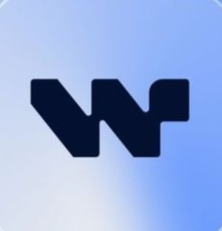
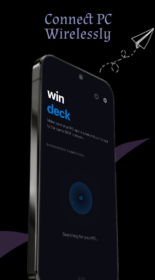
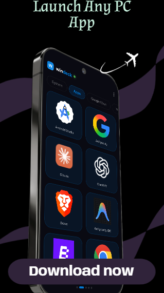
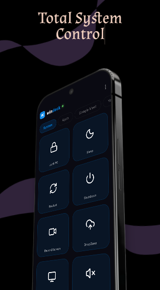
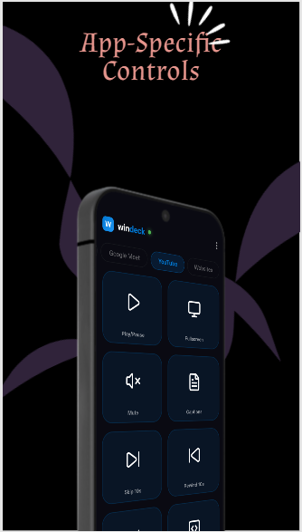
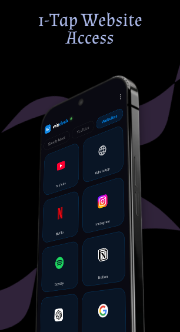

<div align="center">
  

  <h1>WinDeck</h1>

  <p><b>A powerful wireless control suite that transforms your Android phone into a remote control for your Windows PC.</b></p>
  
  <p>
    <a href="https://github.com/Satbhai444/WINDECK/releases/latest" style="text-decoration:none;"></a>
    <a href="https://github.com/Satbhai444/WINDECK/stargazers" style="text-decoration:none;"></a>
    <a href="LICENSE" style="text-decoration:none;"></a>
    <a href="https://website-fawn-nine-99.vercel.app/" style="text-decoration:none;"></a>
  </p>
  
  <table style="margin: 0 auto; border-collapse: collapse; border: none;">
    <tr>
      <td align="center" style="padding: 15px; border: none;">
        <a href="https://github.com/Satbhai444/WINDECK/releases/latest" style="text-decoration:none;">
          
        </a>
      </td>
      <td align="center" style="padding: 15px; border: none;">
        <a href="https://github.com/Satbhai444/WINDECK/releases/latest" style="text-decoration:none;">
          
        </a>
      </td>
    </tr>
  </table>
</div>

---

## Overview

WinDeck delivers a seamless, premium remote control experience by leveraging a high-speed WebSocket connection over your local network. It brings powerful extras including custom macros, real-time PC clipboard synchronization, virtual webcam streaming, and a highly customizable UI.

---

## Table of Contents

- [Overview](#overview)
- [Screenshots](#screenshots)
- [Features](#features)
- [Installation & Setup](#installation--setup)
- [Community & Support](#community--support)
- [Support the Project](#support-the-project)
- [Contributors](#contributors)

---

## Screenshots

<div align="center">
  <table style="margin: 0 auto; border-collapse: collapse;">
    <tr>
      <td align="center" style="padding: 15px; border: none;">
        <b>Connect to PC</b><br><br>
        
      </td>
      <td align="center" style="padding: 15px; border: none;">
        <b>Launch Apps</b><br><br>
        
      </td>
      <td align="center" style="padding: 15px; border: none;">
        <b>System Control</b><br><br>
        
      </td>
    </tr>
    <tr>
      <td align="center" style="padding: 15px; border: none;">
        <b>Custom App Controls</b><br><br>
        
      </td>
      <td align="center" style="padding: 15px; border: none;">
        <b>Website Access</b><br><br>
        
      </td>
      <td align="center" style="padding: 15px; border: none;">
      </td>
    </tr>
  </table>
</div>

---

## Features

<details>
<summary><b>Media & System Controls</b></summary>
<br>

- **Media Control** — Play/pause, next, previous track with live media info.
- **Volume & Brightness** — Control system volume and screen brightness remotely.
- **Air Mouse** — Use your phone as a wireless mouse with gyroscope support.
- **Presentation Control** — Navigate slides seamlessly during presentations.

</details>

<details>
<summary><b>App & File Management</b></summary>
<br>

- **App Launcher** — Launch any installed PC application instantly from your phone.
- **Active Window Tracking** — See which app is currently active on your PC.
- **File Transfer** — Send files between your PC and phone wirelessly.

</details>

<details>
<summary><b>Productivity & Automation</b></summary>
<br>

- **Custom Macros** — Execute complex PowerShell scripts with a single tap.
- **Custom Pages** — Create, rename, reorder, and manage control pages for specific apps.
- **Clipboard Sync** — Seamlessly share clipboard text between PC and phone.
- **System Monitor** — View live CPU & RAM usage directly on your phone.
- **Camera Bridge** — Stream your phone's camera to your PC as a virtual webcam.

</details>

<details>
<summary><b>Security & Performance</b></summary>
<br>

- **Encrypted Connection** — AES-256-CBC encrypted communication.
- **OTP Authentication** — Secure device pairing using a 6-digit code.
- **OTA Updates** — Auto-update directly via GitHub Releases.

</details>

---

## Installation & Setup

### Requirements
- **Windows PC** (Windows 10/11)
- **Android Phone** (Android 6.0+)
- Both devices connected to the **same WiFi/LAN network**.

### Quick Start

1. **Download** the latest release from the [GitHub Releases Page](https://github.com/Satbhai444/WINDECK/releases/latest).
   - Install `WinDeck_Server_Setup_x.x.x.exe` on your PC.
   - Install `windeck-vx.x.x.apk` on your phone.
2. **Start the PC Server**
   - Launch WinDeck on your PC and click **Create a Room**.
3. **Connect the App**
   - Open WinDeck on your Android phone.
   - Find your PC on the network and enter the **6-digit pairing code**.
4. **Done!** Start controlling your PC.

<details>
<summary><b>Architecture details</b></summary>
<br>

```text
┌─────────────────────┐          WiFi / LAN          ┌──────────────────────┐
│   WinDeck Server    │◄────── Socket.IO + HTTP ──────►│    WinDeck App       │
│   (Electron/Node)   │          (Encrypted)          │    (Flutter/Dart)    │
│                     │                               │                     │
│  • Express HTTP     │    ◄── UDP Broadcast ──►      │  • Auto Discovery    │
│  • Socket.IO        │    ◄── mDNS/Bonjour ──►       │  • NSD/mDNS          │
│  • PowerShell IPC   │                               │  • Provider State    │
│  • Media Sessions   │                               │  • Material Design   │
│  • Icon Extraction  │                               │  • Sensors/Gyro      │
└─────────────────────┘                               └──────────────────────┘
```

</details>

---

## Community & Support

Join the community for updates, discussions, and help!

<div align="center">
  <table style="margin: 0 auto; border-collapse: collapse; border: none;">
    <tr>
      <td align="center" style="padding: 15px; border: none;">
        <a href="https://github.com/Satbhai444/WINDECK/issues" style="text-decoration:none;"></a>
      </td>
      <td align="center" style="padding: 15px; border: none;">
        <a href="mailto:darshan.satbhai@gmail.com" style="text-decoration:none;"></a>
      </td>
    </tr>
  </table>
</div>

---

## Support the Project

If WinDeck has been useful to you, consider supporting its development and connecting with me.

<div align="center">
  <table style="margin: 0 auto; border-collapse: collapse; border: none;">
    <tr>
      <td align="center" style="padding: 15px; border: none;">
        <a href="https://website-fawn-nine-99.vercel.app/" style="text-decoration:none;"></a>
      </td>
      <td align="center" style="padding: 15px; border: none;">
        <a href="https://www.linkedin.com/in/darshan-satbhai-212600423" style="text-decoration:none;"></a>
      </td>
      <td align="center" style="padding: 15px; border: none;">
        <a href="https://www.instagram.com/darshaan_satbhai" style="text-decoration:none;"></a>
      </td>
    </tr>
  </table>
</div>

---

## Contributors

A huge thank you to everyone who has helped improve WinDeck! 

<div align="center">
  <a href="https://github.com/Satbhai444/WINDECK/graphs/contributors">
    
  </a>
</div>

---

<div align="center">
  <p>Licensed under the <a href="LICENSE">MIT License</a>.</p>
  <p>Developed with ❤️ by Darshan Satbhai</p>
</div>
